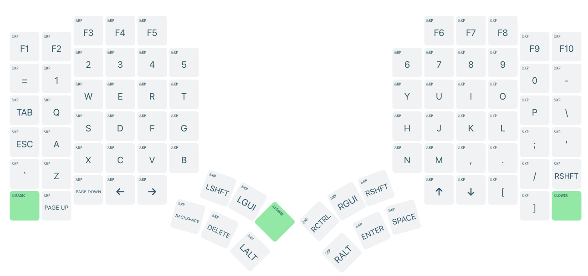
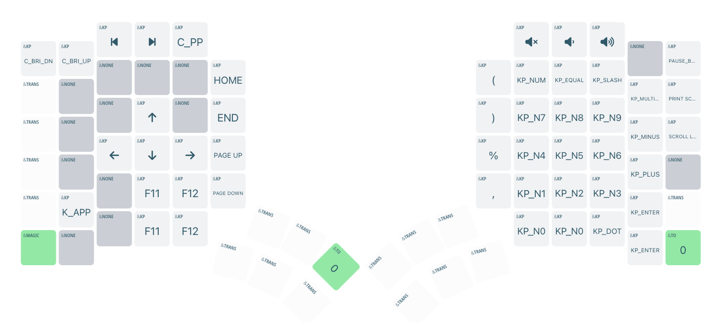
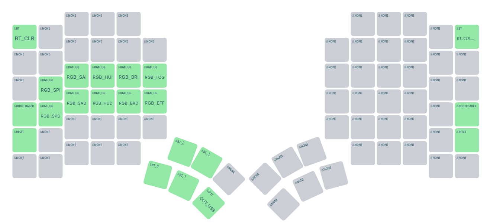

# Glove80 Keymaps

Fairly lightweight and standard set of layers with some of the CMD, Ctrl, Alt, Shift keys moved around and more options for enabling lower layers.

## Layer 0 - Base

## Layer 1 - Lower

## Layer 2 - Magic

